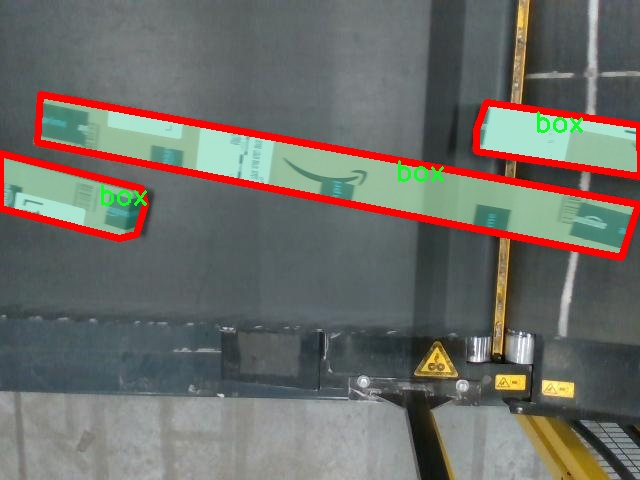

# 分拣线物体图像分割系统源码＆数据集分享
 [yolov8-seg-goldyolo＆yolov8-seg-dyhead-DCNV3等50+全套改进创新点发刊_一键训练教程_Web前端展示]

### 1.研究背景与意义

项目参考[ILSVRC ImageNet Large Scale Visual Recognition Challenge](https://gitee.com/YOLOv8_YOLOv11_Segmentation_Studio/projects)

项目来源[AAAI Global Al lnnovation Contest](https://kdocs.cn/l/cszuIiCKVNis)

研究背景与意义

随着工业自动化的不断发展，物体识别与分拣技术在现代制造业和物流领域中扮演着越来越重要的角色。传统的分拣系统往往依赖于人工操作，不仅效率低下，而且容易受到人为因素的影响，导致错误率上升。近年来，深度学习技术的迅猛发展为物体识别和分拣提供了新的解决方案，尤其是基于卷积神经网络（CNN）的目标检测和图像分割技术，极大地提升了自动化分拣系统的智能化水平。YOLO（You Only Look Once）系列模型作为一种高效的目标检测算法，因其实时性和准确性受到广泛关注。

在众多YOLO模型中，YOLOv8作为最新版本，结合了多种先进的深度学习技术，具有更高的检测精度和更快的推理速度。然而，针对特定应用场景的YOLOv8模型仍然存在一定的局限性，尤其是在复杂背景下的物体分割任务中。因此，基于改进YOLOv8的分拣线物体图像分割系统的研究显得尤为重要。

本研究旨在利用YOLOv8的优势，结合实例分割技术，开发一个高效的分拣线物体图像分割系统。该系统将针对特定的物体类别——箱子（box），通过对1300张图像的数据集进行训练和优化，提升模型在实际应用中的表现。该数据集的构建为模型的训练提供了丰富的样本，涵盖了不同角度、光照和背景下的箱子图像，确保了模型的泛化能力。

研究的意义在于，首先，通过改进YOLOv8模型，能够实现对分拣线上的箱子进行高精度的实例分割，从而提高自动化分拣系统的效率和准确性。其次，基于深度学习的图像分割技术能够有效减少人工干预，降低人力成本，提升生产效率。此外，该系统的成功应用还将为其他物体分类和分拣任务提供参考，推动相关领域的技术进步。

最后，随着电子商务和物流行业的快速发展，物体分拣的需求日益增加，基于改进YOLOv8的分拣线物体图像分割系统不仅具有重要的学术价值，也具备广泛的应用前景。通过本研究，期望能够为未来的智能制造和物流自动化提供新的思路和解决方案，助力行业的转型升级。

### 2.图片演示


##### 注意：由于此博客编辑较早，上面“2.图片演示”和“3.视频演示”展示的系统图片或者视频可能为老版本，新版本在老版本的基础上升级如下：（实际效果以升级的新版本为准）

  （1）适配了YOLOV8的“目标检测”模型和“实例分割”模型，通过加载相应的权重（.pt）文件即可自适应加载模型。

  （2）支持“图片识别”、“视频识别”、“摄像头实时识别”三种识别模式。

  （3）支持“图片识别”、“视频识别”、“摄像头实时识别”三种识别结果保存导出，解决手动导出（容易卡顿出现爆内存）存在的问题，识别完自动保存结果并导出到tempDir中。

  （4）支持Web前端系统中的标题、背景图等自定义修改，后面提供修改教程。

  另外本项目提供训练的数据集和训练教程,暂不提供权重文件（best.pt）,需要您按照教程进行训练后实现图片演示和Web前端界面演示的效果。

### 3.视频演示

[3.1 视频演示](https://www.bilibili.com/video/BV1v415YDEco/)

### 4.数据集信息展示

##### 4.1 本项目数据集详细数据（类别数＆类别名）

nc: 1
names: ['box']


##### 4.2 本项目数据集信息介绍

数据集信息展示

在本研究中，我们使用了名为“round shape detection”的数据集，旨在训练和改进YOLOv8-seg模型，以实现高效的分拣线物体图像分割系统。该数据集专注于特定的物体类别，具有独特的应用价值，尤其是在自动化分拣和物体识别领域。数据集的设计充分考虑了实际应用中的需求，确保模型能够在复杂环境中准确识别和分割目标物体。

“round shape detection”数据集包含了丰富的图像样本，所有样本均围绕着一个主要类别进行构建，即“box”。尽管类别数量相对较少，但这一单一类别的设计使得数据集在特定任务上的专注性和有效性得以提升。通过对“box”这一类别的多样化样本进行采集，数据集涵盖了不同的角度、光照条件和背景环境，确保模型在训练过程中能够学习到丰富的特征和变化。这种多样性不仅提高了模型的鲁棒性，还增强了其在实际应用中的适应能力。

在数据集的构建过程中，图像样本的选择和标注至关重要。每一张图像都经过精心挑选，确保其代表性和多样性。同时，图像中的“box”物体被准确地标注，以便于YOLOv8-seg模型在训练时能够清晰地识别和分割目标。这种精确的标注不仅提高了模型的训练效率，还为后续的评估和测试提供了可靠的基础。

为了进一步增强数据集的实用性，我们还对图像进行了多种数据增强处理。这些处理包括旋转、缩放、翻转和亮度调整等，以模拟不同的现实场景。这种数据增强策略使得模型在面对未知环境时，能够更好地应对各种挑战，提升了其在分拣线上的实际应用能力。

在训练过程中，我们将“round shape detection”数据集与YOLOv8-seg模型相结合，旨在实现更高效的物体检测和分割。YOLOv8-seg作为一种先进的深度学习模型，具备快速处理和高精度识别的能力，非常适合于分拣线物体的实时监测和管理。通过使用该数据集，我们希望能够优化模型的参数，提升其在分拣任务中的表现。

总之，“round shape detection”数据集为本研究提供了坚实的基础，通过对“box”这一类别的深入挖掘和分析，我们期望能够推动YOLOv8-seg模型在物体图像分割领域的应用。未来，我们将继续探索数据集的扩展和优化，以适应更复杂的分拣场景和需求，推动自动化分拣技术的发展。





### 5.全套项目环境部署视频教程（零基础手把手教学）

[5.1 环境部署教程链接（零基础手把手教学）](https://www.bilibili.com/video/BV1jG4Ve4E9t/?vd_source=bc9aec86d164b67a7004b996143742dc)


[5.2 安装Python虚拟环境创建和依赖库安装视频教程链接（零基础手把手教学）](https://www.bilibili.com/video/BV1nA4VeYEze/?vd_source=bc9aec86d164b67a7004b996143742dc)

### 6.手把手YOLOV8-seg训练视频教程（零基础小白有手就能学会）

[6.1 手把手YOLOV8-seg训练视频教程（零基础小白有手就能学会）](https://www.bilibili.com/video/BV1cA4VeYETe/?vd_source=bc9aec86d164b67a7004b996143742dc)


按照上面的训练视频教程链接加载项目提供的数据集，运行train.py即可开始训练



     Epoch   gpu_mem       box       obj       cls    labels  img_size
     1/200     0G   0.01576   0.01955  0.007536        22      1280: 100%|██████████| 849/849 [14:42<00:00,  1.04s/it]
               Class     Images     Labels          P          R     mAP@.5 mAP@.5:.95: 100%|██████████| 213/213 [01:14<00:00,  2.87it/s]
                 all       3395      17314      0.994      0.957      0.0957      0.0843

     Epoch   gpu_mem       box       obj       cls    labels  img_size
     2/200     0G   0.01578   0.01923  0.007006        22      1280: 100%|██████████| 849/849 [14:44<00:00,  1.04s/it]
               Class     Images     Labels          P          R     mAP@.5 mAP@.5:.95: 100%|██████████| 213/213 [01:12<00:00,  2.95it/s]
                 all       3395      17314      0.996      0.956      0.0957      0.0845

     Epoch   gpu_mem       box       obj       cls    labels  img_size
     3/200     0G   0.01561    0.0191  0.006895        27      1280: 100%|██████████| 849/849 [10:56<00:00,  1.29it/s]
               Class     Images     Labels          P          R     mAP@.5 mAP@.5:.95: 100%|███████   | 187/213 [00:52<00:00,  4.04it/s]
                 all       3395      17314      0.996      0.957      0.0957      0.0845


### 7.50+种全套YOLOV8-seg创新点代码加载调参视频教程（一键加载写好的改进模型的配置文件）

[7.1 50+种全套YOLOV8-seg创新点代码加载调参视频教程（一键加载写好的改进模型的配置文件）](https://www.bilibili.com/video/BV1Hw4VePEXv/?vd_source=bc9aec86d164b67a7004b996143742dc)

### 8.YOLOV8-seg图像分割算法原理

原始YOLOv8-seg算法原理

YOLOv8-seg算法是YOLO系列目标检测算法的最新进展，旨在通过引入更为先进的特征提取和融合技术，提升目标检测的精度和效率。该算法的设计围绕着三个主要组成部分展开：Backbone、Neck和Head。每个部分都经过精心设计，以确保在处理复杂场景时能够有效捕捉目标特征并进行准确分类。

在Backbone部分，YOLOv8-seg采用了一系列卷积和反卷积层，利用残差连接和瓶颈结构来减小网络规模并提升性能。具体而言，Backbone由多个CBS模块、C2f模块和一个快速空间金字塔池化(SPPF)模块构成。CBS模块结合了卷积、归一化和SiLU激活函数，通过卷积层提取目标的纹理和颜色特征，同时通过归一化技术解决反向传播过程中的梯度消失和梯度爆炸问题。C2f模块则在YOLOv5的C3模块基础上进行了改进，采用了ELAN思想，增强了特征流的利用效率。通过这种设计，YOLOv8-seg能够在保持较小模型规模的同时，显著提升检测精度。

Neck部分则采用了PAN-FPN结构，这一结构的核心在于多尺度特征融合技术。通过将来自Backbone不同阶段的特征图进行融合，YOLOv8-seg能够更好地捕捉不同尺度目标的信息。这种融合不仅提高了目标检测的性能，还增强了模型在复杂环境下的鲁棒性。具体而言，Neck结构通过自下而上的特征融合，结合高层特征与中层、浅层特征，确保每一层的特征图都包含丰富的语义信息和细节信息，从而提高了目标检测的准确性。

Head部分负责最终的目标检测和分类任务。YOLOv8-seg的Head结构采用了解耦设计，将分类和回归任务分开处理。这样的设计使得每个任务能够更加专注于自身的目标，从而解决了复杂场景下定位不准和分类错误的问题。Head部分包含三个检测头，分别用于处理不同尺寸的信息，确保模型能够在多种尺度下进行有效的目标检测。每个检测头通过一系列卷积层和反卷积层生成检测结果，最终输出目标的类别和位置。

YOLOv8-seg还引入了Anchor-Free的目标检测思想，摒弃了传统的Anchor-Base方法。这一创新使得模型在预测目标位置时不再依赖于预先定义的锚点框，而是通过回归的方式直接预测目标的位置和大小。这种方法不仅简化了模型的设计，还提高了模型对不同尺度和形状目标的适应能力，使得YOLOv8-seg在实际应用中表现出色。

此外，YOLOv8-seg在损失函数的设计上也进行了创新，采用了VFLLoss作为分类损失，DFLLoss和CIoULoss作为回归损失。这些损失函数的选择旨在提升模型的训练效果，特别是在处理样本不平衡和困难样本时，能够有效提高网络的学习能力和收敛速度。

在数据预处理方面，YOLOv8-seg借鉴了YOLOv5的策略，采用了包括马赛克增强、混合增强、空间扰动和颜色扰动等多种数据增强手段。这些增强手段的引入，不仅丰富了训练数据的多样性，还提高了模型的泛化能力，使得YOLOv8-seg在不同场景下均能保持良好的检测性能。

总的来说，YOLOv8-seg算法通过对Backbone、Neck和Head的精心设计，以及对传统目标检测方法的创新性改进，成功地提升了目标检测的精度和效率。其在处理复杂场景时的鲁棒性和灵活性，使得YOLOv8-seg成为当前目标检测领域的一项重要进展。通过不断优化和改进，YOLOv8-seg不仅为学术研究提供了新的思路，也为实际应用中的目标检测任务提供了强有力的支持。


### 9.系统功能展示（检测对象为举例，实际内容以本项目数据集为准）

图9.1.系统支持检测结果表格显示

  图9.2.系统支持置信度和IOU阈值手动调节

  图9.3.系统支持自定义加载权重文件best.pt(需要你通过步骤5中训练获得)

  图9.4.系统支持摄像头实时识别

  图9.5.系统支持图片识别

  图9.6.系统支持视频识别

  图9.7.系统支持识别结果文件自动保存

  图9.8.系统支持Excel导出检测结果数据


### 10.50+种全套YOLOV8-seg创新点原理讲解（非科班也可以轻松写刊发刊，V11版本正在科研待更新）

#### 10.1 由于篇幅限制，每个创新点的具体原理讲解就不一一展开，具体见下列网址中的创新点对应子项目的技术原理博客网址【Blog】：


[10.1 50+种全套YOLOV8-seg创新点原理讲解链接](https://gitee.com/qunmasj/good)

#### 10.2 部分改进模块原理讲解(完整的改进原理见上图和技术博客链接)【如果此小节的图加载失败可以通过CSDN或者Github搜索该博客的标题访问原始博客，原始博客图片显示正常】
### 全维动态卷积ODConv
鉴于上述讨论，我们的ODConv引入了一种多维注意机制，该机制具有并行策略，用于学习卷积核在核空间的所有四个维度上的不同注意。图提供了CondConv、DyConv和ODConv的示意性比较。

ODConv的公式：根据等式1中的符号，ODConv可定义为


 将注意力标量分配给整个卷积核。图2示出了将这四种类型的关注乘以n个卷积核的过程。原则上，这四种类型的关注是相互补充的，并且以位置、信道、滤波器和核的顺序将它们逐步乘以卷积核 
 ，使得卷积运算不同w.r.t.所有空间位置、所有输入信道、所有滤波器和输入x的所有核，提供捕获丰富上下文线索的性能保证。因此，ODConv可以显著增强CNN基本卷积运算的特征提取能力。此外，具有单个卷积核的ODConv可以与标准CondConv和DyConv竞争或优于它们，为最终模型引入的额外参数大大减少。提供了大量实验来验证这些优点。通过比较等式1和等式2，我们可以清楚地看到，ODConv是一种更广义的动态卷积。此外，当设置n=1且 所有分量均为1时，只关注滤波器方向 的ODConv将减少为：将基于输入特征的SE变量应用于卷积滤波器，然后进行卷积运算（注意原始SE（Hu等人，2018b）基于输出特征，并且用于重新校准输出特征本身）。这种SE变体是ODConv的特例。


图：将ODConv中的四种注意类型逐步乘以卷积核的示例。（a） 沿空间维度的逐位置乘法运算，（b）沿输入信道维度的逐信道乘法运算、（c）沿输出信道维度的按滤波器乘法运算，以及（d）沿卷积核空间的核维度的按核乘法运算。方法部分对符号进行了说明
实现：对于ODConv，一个关键问题是如何计算卷积核的四种关注度 。继CondConv和DyConv之后，我们还使用SE型注意力模块（Hu等人，2018b），但将多个头部作为来计算它们，其结构如图所示。具体而言，首先通过逐通道全局平均池（GAP）运算将输入压缩到具有长度的特征向量中。随后，存在完全连接（FC）层和四个头部分支。ReLU（Krizhevsky等人，2012）位于FC层之后。FC层将压缩特征向量映射到具有缩减比的低维空间（根据消融实验，我们在所有主要实验中设置 ，避免了高模型复杂度）。对于四个头部分支，每个分支都有一个输出大小如图。

### 引入ODConv的改进YOLO
参考这篇博客涵盖了引入ODConv的改进YOLOv8系统的内容，ODConv采用多维注意机制，在卷积核空间的四个维度上学习不同的注意。结合了CondConv和DyConv的优势，ODConv通过图示的四种注意类型逐步与卷积核相乘，以捕获丰富的上下文线索，提升特征提取能力。

#### ODConv结构与方法
ODConv的公式和图示展示了其关注力分配给卷积核的方式，其中四种类型的关注以位置、信道、滤波器和核的顺序逐步与卷积核相乘。这种结构保证了卷积运算不同于标准的Conv操作，能够捕获更多上下文信息，从而增强了CNN的特征提取能力。另外，单个卷积核的ODConv在性能上能够与CondConv和DyConv相竞争，并且引入的额外参数大幅减少。

ODConv的特殊之处在于其广义的动态卷积性质，同时在特定条件下（n=1且所有分量为1），它可以退化为一种特例，即只关注滤波器方向，这类似于基于输入特征的SE变体，但不同于原始SE，它基于输出特征。

#### ODConv的实现
关键问题在于如何计算卷积核的四种关注度。ODConv采用了SE型注意力模块，结合了多个头部来计算这些关注度。具体实现上，通过逐通道全局平均池运算和完全连接层，将输入压缩为特征向量，随后使用四个头部分支来计算四种不同类型的关注。这样的结构能在保持模型复杂度可控的情况下，提升了特征的表征能力。

ODConv的引入为YOLOv8带来了显著的性能提升，并且通过大量实验证明了其在特征提取方面的优越性。其结合了多维注意机制和卷积操作，为目标检测和分拣系统的提升带来了新的思路和性能突破。


### 11.项目核心源码讲解（再也不用担心看不懂代码逻辑）

#### 11.1 ultralytics\nn\extra_modules\ops_dcnv3\functions\dcnv3_func.py

以下是对代码的逐文件分析，保留了最核心的部分，并添加了详细的中文注释：

```python
# --------------------------------------------------------
# InternImage
# Copyright (c) 2022 OpenGVLab
# Licensed under The MIT License [see LICENSE for details]
# --------------------------------------------------------

import torch
import torch.nn.functional as F
from torch.autograd import Function
from torch.cuda.amp import custom_bwd, custom_fwd

# 定义 DCNv3Function 类，继承自 Function 类
class DCNv3Function(Function):
    @staticmethod
    @custom_fwd
    def forward(ctx, input, offset, mask, kernel_h, kernel_w, stride_h, stride_w, pad_h, pad_w, dilation_h, dilation_w, group, group_channels, offset_scale, im2col_step, remove_center):
        # 保存前向传播所需的参数
        ctx.kernel_h = kernel_h
        ctx.kernel_w = kernel_w
        ctx.stride_h = stride_h
        ctx.stride_w = stride_w
        ctx.pad_h = pad_h
        ctx.pad_w = pad_w
        ctx.dilation_h = dilation_h
        ctx.dilation_w = dilation_w
        ctx.group = group
        ctx.group_channels = group_channels
        ctx.offset_scale = offset_scale
        ctx.im2col_step = im2col_step
        ctx.remove_center = remove_center

        # 准备参数并调用 DCNv3 的前向函数
        args = [input, offset, mask, kernel_h, kernel_w, stride_h, stride_w, pad_h, pad_w, dilation_h, dilation_w, group, group_channels, offset_scale, ctx.im2col_step]
        if remove_center:
            args.append(remove_center)

        output = DCNv3.dcnv3_forward(*args)  # 调用外部 DCNv3 库的前向函数
        ctx.save_for_backward(input, offset, mask)  # 保存输入以便反向传播使用

        return output  # 返回输出结果

    @staticmethod
    @once_differentiable
    @custom_bwd
    def backward(ctx, grad_output):
        # 反向传播，计算梯度
        input, offset, mask = ctx.saved_tensors  # 获取保存的输入

        # 准备参数并调用 DCNv3 的反向函数
        args = [input, offset, mask, ctx.kernel_h, ctx.kernel_w, ctx.stride_h, ctx.stride_w, ctx.pad_h, ctx.pad_w, ctx.dilation_h, ctx.dilation_w, ctx.group, ctx.group_channels, ctx.offset_scale, grad_output.contiguous(), ctx.im2col_step]
        if ctx.remove_center:
            args.append(ctx.remove_center)

        grad_input, grad_offset, grad_mask = DCNv3.dcnv3_backward(*args)  # 调用外部 DCNv3 库的反向函数

        return grad_input, grad_offset, grad_mask, None, None, None, None, None, None, None, None, None, None, None, None, None  # 返回梯度

def dcnv3_core_pytorch(input, offset, mask, kernel_h, kernel_w, stride_h, stride_w, pad_h, pad_w, dilation_h, dilation_w, group, group_channels, offset_scale, remove_center):
    # 核心的 DCNv3 实现，使用 PyTorch 进行计算

    # 检查 remove_center 参数的有效性
    if remove_center and (kernel_h % 2 == 0 or kernel_w % 2 == 0 or kernel_w != kernel_h):
        raise ValueError('remove_center is only compatible with square odd kernel size.')

    # 对输入进行填充
    input = F.pad(input, [0, 0, pad_h, pad_h, pad_w, pad_w])
    N_, H_in, W_in, _ = input.shape  # 获取输入的形状
    _, H_out, W_out, _ = offset.shape  # 获取偏移量的形状

    # 计算参考点和采样网格
    ref = _get_reference_points(input.shape, input.device, kernel_h, kernel_w, dilation_h, dilation_w, pad_h, pad_w, stride_h, stride_w)
    grid = _generate_dilation_grids(input.shape, kernel_h, kernel_w, dilation_h, dilation_w, group, input.device)

    # 计算采样位置
    sampling_locations = (ref + grid * offset_scale).repeat(N_, 1, 1, 1, 1)
    if remove_center:
        sampling_locations = remove_center_sampling_locations(sampling_locations, kernel_w=kernel_w, kernel_h=kernel_h)
    sampling_locations = sampling_locations.flatten(3, 4)

    # 进行双线性插值采样
    sampling_input_ = F.grid_sample(input.view(N_, H_in * W_in, group * group_channels).transpose(1, 2).reshape(N_ * group, group_channels, H_in, W_in), sampling_locations, mode='bilinear', padding_mode='zeros', align_corners=False)

    # 计算输出
    output = (sampling_input_ * mask.view(N_, H_out * W_out, group, -1).transpose(1, 2).reshape(N_ * group, 1, H_out * W_out, -1)).sum(-1).view(N_, group * group_channels, H_out * W_out)

    return output.transpose(1, 2).reshape(N_, H_out, W_out, -1).contiguous()  # 返回最终输出
```

### 代码分析
1. **DCNv3Function 类**：定义了一个自定义的 PyTorch 函数，包含前向和反向传播的实现。
2. **forward 方法**：负责计算前向传播，保存必要的上下文信息，并调用外部的 DCNv3 库进行计算。
3. **backward 方法**：实现反向传播，计算输入、偏移量和掩码的梯度。
4. **dcnv3_core_pytorch 函数**：实现了 DCNv3 的核心计算逻辑，包括输入填充、参考点和采样网格的计算，以及最终的双线性插值和输出生成。

以上是对代码的核心部分的提炼和详细注释，便于理解其功能和实现细节。

这个文件 `dcnv3_func.py` 是一个实现了 DCNv3（Deformable Convolutional Networks v3）功能的 PyTorch 自定义操作。该文件包含了前向和反向传播的计算，以及一些辅助函数，用于生成采样位置和处理输入数据。

首先，文件引入了一些必要的库，包括 PyTorch 和相关的自动求导功能。DCNv3 是一种改进的可变形卷积网络，能够通过学习偏移量来调整卷积核的位置，从而更好地适应输入特征图的形状。

在 `DCNv3Function` 类中，定义了两个静态方法：`forward` 和 `backward`。`forward` 方法负责执行前向传播，接收输入张量、偏移量、掩码以及卷积参数（如核的高度和宽度、步幅、填充等），并调用 DCNv3 的前向函数进行计算。计算完成后，保存输入、偏移量和掩码以供反向传播使用。

`backward` 方法则负责反向传播，接收梯度输出，并根据保存的张量和之前的参数计算输入、偏移量和掩码的梯度。这里同样调用了 DCNv3 的反向函数。

此外，`symbolic` 方法用于在 ONNX 导出时定义该操作的符号表示，以便在不同的深度学习框架中进行迁移。

文件中还定义了一些辅助函数。`_get_reference_points` 函数用于计算参考点，这些点用于确定在输入特征图上进行采样的位置。`_generate_dilation_grids` 函数生成膨胀网格，用于调整卷积核的采样位置。`remove_center_sampling_locations` 函数则用于移除中心采样位置，以适应特定的卷积核配置。

最后，`dcnv3_core_pytorch` 函数实现了 DCNv3 的核心逻辑，包括输入的填充、参考点和采样位置的计算，以及最终的采样和输出的处理。这个函数是调试和测试用的，实际使用时需要调用 CUDA 版本以获得更好的性能。

整体来看，这个文件实现了 DCNv3 的核心功能，允许用户在 PyTorch 中使用可变形卷积，增强了卷积神经网络对输入特征图形状变化的适应能力。

#### 11.2 ultralytics\nn\extra_modules\ops_dcnv3\setup.py

以下是经过简化和注释的核心代码部分：

```python
# 导入必要的库
import os
import glob
import torch
from torch.utils.cpp_extension import CUDA_HOME, CppExtension, CUDAExtension
from setuptools import find_packages, setup

# 定义所需的Python包
requirements = ["torch", "torchvision"]

def get_extensions():
    # 获取当前文件的目录
    this_dir = os.path.dirname(os.path.abspath(__file__))
    # 定义扩展模块的源代码目录
    extensions_dir = os.path.join(this_dir, "src")

    # 查找主文件和CPU、CUDA源文件
    main_file = glob.glob(os.path.join(extensions_dir, "*.cpp"))
    source_cpu = glob.glob(os.path.join(extensions_dir, "cpu", "*.cpp"))
    source_cuda = glob.glob(os.path.join(extensions_dir, "cuda", "*.cu"))

    # 将主文件和CPU源文件合并
    sources = main_file + source_cpu
    extension = CppExtension  # 默认使用 CppExtension
    extra_compile_args = {"cxx": []}  # 编译参数
    define_macros = []  # 宏定义

    # 检查CUDA是否可用
    if torch.cuda.is_available() and CUDA_HOME is not None:
        extension = CUDAExtension  # 使用CUDA扩展
        sources += source_cuda  # 添加CUDA源文件
        define_macros += [("WITH_CUDA", None)]  # 定义WITH_CUDA宏
        extra_compile_args["nvcc"] = []  # 可以添加nvcc编译参数
    else:
        raise NotImplementedError('Cuda is not available')  # 如果CUDA不可用，抛出异常

    # 生成完整的源文件路径
    sources = [os.path.join(extensions_dir, s) for s in sources]
    include_dirs = [extensions_dir]  # 包含目录

    # 创建扩展模块
    ext_modules = [
        extension(
            "DCNv3",  # 扩展模块名称
            sources,  # 源文件列表
            include_dirs=include_dirs,  # 包含目录
            define_macros=define_macros,  # 宏定义
            extra_compile_args=extra_compile_args,  # 编译参数
        )
    ]
    return ext_modules  # 返回扩展模块列表

# 设置包信息和扩展模块
setup(
    name="DCNv3",  # 包名称
    version="1.1",  # 版本号
    author="InternImage",  # 作者
    url="https://github.com/OpenGVLab/InternImage",  # 项目链接
    description="PyTorch Wrapper for CUDA Functions of DCNv3",  # 描述
    packages=find_packages(exclude=("configs", "tests")),  # 查找包，排除指定目录
    ext_modules=get_extensions(),  # 获取扩展模块
    cmdclass={"build_ext": torch.utils.cpp_extension.BuildExtension},  # 自定义构建命令
)
```

### 代码说明：
1. **导入库**：导入了必要的库，包括操作系统相关的库、文件查找库、PyTorch库和setuptools库。
2. **获取扩展函数**：`get_extensions`函数用于查找源文件并创建PyTorch扩展模块。它会根据CUDA的可用性选择合适的扩展类型（CPU或CUDA）。
3. **设置包信息**：使用`setup`函数来定义包的基本信息和扩展模块，便于后续的安装和使用。

这个 `setup.py` 文件是用于配置和构建一个名为 DCNv3 的 Python 包，该包主要是为 PyTorch 提供 CUDA 函数的封装。文件开头包含了一些版权信息和许可证声明，表明该代码由 OpenGVLab 开发，并且使用 MIT 许可证。

首先，文件导入了一些必要的模块，包括 `os` 和 `glob` 用于文件路径处理，`torch` 用于 PyTorch 的功能，`CUDA_HOME`、`CppExtension` 和 `CUDAExtension` 是 PyTorch 提供的用于扩展 C++ 和 CUDA 的工具。接着，`setuptools` 模块被导入，用于打包和分发 Python 包。

接下来，定义了一个 `requirements` 列表，列出了该包所依赖的库，这里包括 `torch` 和 `torchvision`。

`get_extensions` 函数用于获取需要编译的扩展模块。它首先确定当前文件的目录，并构建出源代码文件的路径。通过 `glob` 模块，函数查找指定目录下的 `.cpp` 和 `.cu` 文件，分别用于 CPU 和 CUDA 的实现。

在确定了源文件后，函数检查 CUDA 是否可用。如果可用，则使用 `CUDAExtension` 来构建扩展，并将 CUDA 源文件添加到编译列表中，同时定义了一些宏和编译参数。如果 CUDA 不可用，则抛出一个 `NotImplementedError` 异常，表示该功能不支持。

最后，函数返回一个包含扩展模块信息的列表。`setup` 函数则使用这些信息来配置包的名称、版本、作者、描述、需要排除的包以及扩展模块等。`cmdclass` 参数指定了自定义的构建扩展命令，以便在构建时调用 PyTorch 的构建扩展工具。

总体而言，这个 `setup.py` 文件的主要功能是为 DCNv3 包的构建和安装提供必要的配置，确保在支持 CUDA 的环境中能够正确编译和链接相关的 C++ 和 CUDA 代码。

#### 11.3 ultralytics\models\sam\modules\decoders.py

以下是代码中最核心的部分，并附上详细的中文注释：

```python
class MaskDecoder(nn.Module):
    """
    MaskDecoder类用于生成掩码及其相关质量分数，使用变换器架构根据图像和提示嵌入预测掩码。
    """

    def __init__(
        self,
        *,
        transformer_dim: int,
        transformer: nn.Module,
        num_multimask_outputs: int = 3,
        activation: Type[nn.Module] = nn.GELU,
        iou_head_depth: int = 3,
        iou_head_hidden_dim: int = 256,
    ) -> None:
        """
        初始化MaskDecoder类的实例。

        参数:
            transformer_dim (int): 变换器模块的通道维度
            transformer (nn.Module): 用于预测掩码的变换器
            num_multimask_outputs (int): 预测的掩码数量
            activation (nn.Module): 用于上采样掩码的激活函数类型
            iou_head_depth (int): 用于预测掩码质量的MLP深度
            iou_head_hidden_dim (int): 用于预测掩码质量的MLP隐藏维度
        """
        super().__init__()
        self.transformer_dim = transformer_dim  # 变换器的通道维度
        self.transformer = transformer  # 变换器模块

        self.num_multimask_outputs = num_multimask_outputs  # 多掩码输出数量

        # IoU令牌的嵌入
        self.iou_token = nn.Embedding(1, transformer_dim)
        self.num_mask_tokens = num_multimask_outputs + 1  # 掩码令牌数量
        self.mask_tokens = nn.Embedding(self.num_mask_tokens, transformer_dim)  # 掩码令牌的嵌入

        # 输出上采样的神经网络序列
        self.output_upscaling = nn.Sequential(
            nn.ConvTranspose2d(transformer_dim, transformer_dim // 4, kernel_size=2, stride=2),
            LayerNorm2d(transformer_dim // 4),
            activation(),
            nn.ConvTranspose2d(transformer_dim // 4, transformer_dim // 8, kernel_size=2, stride=2),
            activation(),
        )
        
        # 生成掩码的超网络MLP
        self.output_hypernetworks_mlps = nn.ModuleList([
            MLP(transformer_dim, transformer_dim, transformer_dim // 8, 3) for _ in range(self.num_mask_tokens)
        ])

        # 预测掩码质量的MLP
        self.iou_prediction_head = MLP(transformer_dim, iou_head_hidden_dim, self.num_mask_tokens, iou_head_depth)

    def forward(
        self,
        image_embeddings: torch.Tensor,
        image_pe: torch.Tensor,
        sparse_prompt_embeddings: torch.Tensor,
        dense_prompt_embeddings: torch.Tensor,
        multimask_output: bool,
    ) -> Tuple[torch.Tensor, torch.Tensor]:
        """
        根据图像和提示嵌入预测掩码。

        参数:
            image_embeddings (torch.Tensor): 图像编码器的嵌入
            image_pe (torch.Tensor): 图像嵌入的位置信息编码
            sparse_prompt_embeddings (torch.Tensor): 稀疏提示的嵌入
            dense_prompt_embeddings (torch.Tensor): 密集提示的嵌入
            multimask_output (bool): 是否返回多个掩码或单个掩码

        返回:
            torch.Tensor: 批量预测的掩码
            torch.Tensor: 批量的掩码质量预测
        """
        # 预测掩码和IoU
        masks, iou_pred = self.predict_masks(
            image_embeddings=image_embeddings,
            image_pe=image_pe,
            sparse_prompt_embeddings=sparse_prompt_embeddings,
            dense_prompt_embeddings=dense_prompt_embeddings,
        )

        # 根据是否需要多个掩码选择正确的掩码
        mask_slice = slice(1, None) if multimask_output else slice(0, 1)
        masks = masks[:, mask_slice, :, :]
        iou_pred = iou_pred[:, mask_slice]

        return masks, iou_pred  # 返回预测的掩码和IoU预测

    def predict_masks(
        self,
        image_embeddings: torch.Tensor,
        image_pe: torch.Tensor,
        sparse_prompt_embeddings: torch.Tensor,
        dense_prompt_embeddings: torch.Tensor,
    ) -> Tuple[torch.Tensor, torch.Tensor]:
        """
        预测掩码。

        参数:
            image_embeddings (torch.Tensor): 图像编码器的嵌入
            image_pe (torch.Tensor): 图像嵌入的位置信息编码
            sparse_prompt_embeddings (torch.Tensor): 稀疏提示的嵌入
            dense_prompt_embeddings (torch.Tensor): 密集提示的嵌入

        返回:
            torch.Tensor: 预测的掩码
            torch.Tensor: 掩码质量的预测
        """
        # 连接输出令牌
        output_tokens = torch.cat([self.iou_token.weight, self.mask_tokens.weight], dim=0)
        output_tokens = output_tokens.unsqueeze(0).expand(sparse_prompt_embeddings.size(0), -1, -1)
        tokens = torch.cat((output_tokens, sparse_prompt_embeddings), dim=1)

        # 扩展每个图像的数据以适应每个掩码
        src = torch.repeat_interleave(image_embeddings, tokens.shape[0], dim=0)
        src = src + dense_prompt_embeddings  # 添加密集提示嵌入
        pos_src = torch.repeat_interleave(image_pe, tokens.shape[0], dim=0)
        b, c, h, w = src.shape  # 获取批量大小、通道数、高度和宽度

        # 运行变换器
        hs, src = self.transformer(src, pos_src, tokens)
        iou_token_out = hs[:, 0, :]  # IoU令牌的输出
        mask_tokens_out = hs[:, 1:(1 + self.num_mask_tokens), :]  # 掩码令牌的输出

        # 上采样掩码嵌入并使用掩码令牌预测掩码
        src = src.transpose(1, 2).view(b, c, h, w)
        upscaled_embedding = self.output_upscaling(src)  # 上采样
        hyper_in_list: List[torch.Tensor] = [
            self.output_hypernetworks_mlps[i](mask_tokens_out[:, i, :]) for i in range(self.num_mask_tokens)
        ]
        hyper_in = torch.stack(hyper_in_list, dim=1)  # 堆叠超网络输出
        masks = (hyper_in @ upscaled_embedding.view(b, c, h * w)).view(b, -1, h, w)  # 生成掩码

        # 生成掩码质量预测
        iou_pred = self.iou_prediction_head(iou_token_out)

        return masks, iou_pred  # 返回掩码和IoU预测
```

### 代码核心部分说明：
1. **MaskDecoder类**：该类是一个神经网络模块，负责根据输入的图像和提示嵌入生成掩码及其质量分数。
2. **初始化方法**：设置了变换器的维度、掩码令牌、IoU令牌、输出上采样网络等。
3. **前向传播方法**：接收图像和提示嵌入，调用`predict_masks`方法进行掩码预测，并根据需要选择输出多个掩码或单个掩码。
4. **掩码预测方法**：通过连接IoU令牌和掩码令牌，扩展输入数据，运行变换器，生成掩码和IoU预测。

这个程序文件定义了一个名为 `MaskDecoder` 的类，它是一个用于生成图像掩码及其质量评分的解码器模块，采用了变换器（Transformer）架构。该类的主要功能是根据图像和提示嵌入生成掩码。

在 `MaskDecoder` 类的构造函数中，初始化了一些重要的属性，包括变换器的维度、变换器模块本身、要预测的掩码数量、IoU（Intersection over Union）令牌的嵌入、掩码令牌的嵌入以及输出上采样的神经网络序列等。输出上采样使用了反卷积层和层归一化，并应用了激活函数（默认为GELU）。此外，还定义了用于生成掩码的超网络MLP（多层感知器）和用于预测掩码质量的MLP。

`forward` 方法是该类的主要入口，用于接收图像嵌入、位置编码、稀疏和密集提示嵌入，并返回预测的掩码和掩码质量。该方法首先调用 `predict_masks` 方法生成掩码和IoU预测，然后根据是否需要多掩码输出来选择相应的掩码和IoU预测。

`predict_masks` 方法则负责具体的掩码预测过程。它首先将IoU令牌和掩码令牌的嵌入进行拼接，并与稀疏提示嵌入结合。接着，图像嵌入和位置编码被扩展，以便与掩码令牌一起输入到变换器中。变换器的输出被用来生成掩码嵌入，并通过上采样网络进行上采样，最终得到掩码。IoU预测则是通过另一个MLP生成的。

此外，文件中还定义了一个 `MLP` 类，它是一个多层感知器模型，用于构建神经网络。该类的构造函数接收输入维度、隐藏层维度、输出维度和层数，并根据这些参数构建网络层。在 `forward` 方法中，输入数据通过各层进行前向传播，并在最后一层应用激活函数（如果需要的话）。

总体而言，这个文件实现了一个复杂的掩码解码器，结合了深度学习中的变换器架构和多层感知器，旨在高效地处理图像分割任务。

#### 11.4 ultralytics\utils\callbacks\wb.py

以下是经过简化和注释的核心代码部分，主要集中在与 WandB 相关的功能上：

```python
# 导入必要的库
from ultralytics.utils import SETTINGS, TESTS_RUNNING
from ultralytics.utils.torch_utils import model_info_for_loggers

try:
    # 确保当前不是在测试模式下
    assert not TESTS_RUNNING  
    # 确保 WandB 集成已启用
    assert SETTINGS['wandb'] is True  
    import wandb as wb  # 导入 WandB 库

    # 确保 WandB 库已正确安装
    assert hasattr(wb, '__version__')  

    import numpy as np
    import pandas as pd

    _processed_plots = {}  # 用于记录已处理的图表

except (ImportError, AssertionError):
    wb = None  # 如果导入失败，则将 wb 设置为 None


def _custom_table(x, y, classes, title='Precision Recall Curve', x_title='Recall', y_title='Precision'):
    """
    创建并记录自定义的精确度-召回率曲线可视化。

    参数:
        x (List): x 轴的值，长度为 N。
        y (List): y 轴的值，长度为 N。
        classes (List): 每个点的类别标签，长度为 N。
        title (str, optional): 图表标题，默认为 'Precision Recall Curve'。
        x_title (str, optional): x 轴标签，默认为 'Recall'。
        y_title (str, optional): y 轴标签，默认为 'Precision'。

    返回:
        (wandb.Object): 适合记录的 WandB 对象，展示自定义的可视化。
    """
    # 创建数据框
    df = pd.DataFrame({'class': classes, 'y': y, 'x': x}).round(3)
    fields = {'x': 'x', 'y': 'y', 'class': 'class'}
    string_fields = {'title': title, 'x-axis-title': x_title, 'y-axis-title': y_title}
    # 返回 WandB 表格对象
    return wb.plot_table('wandb/area-under-curve/v0',
                         wb.Table(dataframe=df),
                         fields=fields,
                         string_fields=string_fields)


def _plot_curve(x, y, names=None, id='precision-recall', title='Precision Recall Curve', x_title='Recall', y_title='Precision', num_x=100, only_mean=False):
    """
    记录度量曲线可视化。

    参数:
        x (np.ndarray): x 轴的数据点，长度为 N。
        y (np.ndarray): y 轴的数据点，形状为 CxN，C 为类别数。
        names (list, optional): 类别名称，长度为 C。
        id (str, optional): 在 WandB 中记录数据的唯一标识符，默认为 'precision-recall'。
        title (str, optional): 可视化图表的标题，默认为 'Precision Recall Curve'。
        x_title (str, optional): x 轴标签，默认为 'Recall'。
        y_title (str, optional): y 轴标签，默认为 'Precision'。
        num_x (int, optional): 可视化的插值数据点数量，默认为 100。
        only_mean (bool, optional): 是否仅绘制均值曲线，默认为 True。
    """
    # 创建新的 x 值
    if names is None:
        names = []
    x_new = np.linspace(x[0], x[-1], num_x).round(5)

    # 创建用于记录的数组
    x_log = x_new.tolist()
    y_log = np.interp(x_new, x, np.mean(y, axis=0)).round(3).tolist()

    if only_mean:
        # 仅记录均值曲线
        table = wb.Table(data=list(zip(x_log, y_log)), columns=[x_title, y_title])
        wb.run.log({title: wb.plot.line(table, x_title, y_title, title=title)})
    else:
        # 记录每个类别的曲线
        classes = ['mean'] * len(x_log)
        for i, yi in enumerate(y):
            x_log.extend(x_new)  # 添加新的 x 值
            y_log.extend(np.interp(x_new, x, yi))  # 将 y 值插值到新的 x 值
            classes.extend([names[i]] * len(x_new))  # 添加类别名称
        wb.log({id: _custom_table(x_log, y_log, classes, title, x_title, y_title)}, commit=False)


def on_fit_epoch_end(trainer):
    """在每个训练周期结束时记录训练指标和模型信息。"""
    wb.run.log(trainer.metrics, step=trainer.epoch + 1)  # 记录训练指标
    # 记录图表
    _log_plots(trainer.plots, step=trainer.epoch + 1)
    _log_plots(trainer.validator.plots, step=trainer.epoch + 1)
    if trainer.epoch == 0:
        wb.run.log(model_info_for_loggers(trainer), step=trainer.epoch + 1)  # 记录模型信息


def on_train_end(trainer):
    """在训练结束时保存最佳模型作为工件。"""
    _log_plots(trainer.validator.plots, step=trainer.epoch + 1)
    _log_plots(trainer.plots, step=trainer.epoch + 1)
    art = wb.Artifact(type='model', name=f'run_{wb.run.id}_model')  # 创建模型工件
    if trainer.best.exists():
        art.add_file(trainer.best)  # 添加最佳模型文件
        wb.run.log_artifact(art, aliases=['best'])  # 记录工件
    wb.run.finish()  # 结束 WandB 运行


# 定义回调函数
callbacks = {
    'on_fit_epoch_end': on_fit_epoch_end,
    'on_train_end': on_train_end
} if wb else {}
```

### 代码说明：
1. **导入和初始化**：导入必要的库，并检查 WandB 是否可用。
2. **自定义表格**：`_custom_table` 函数用于创建和记录精确度-召回率曲线的可视化。
3. **绘制曲线**：`_plot_curve` 函数生成并记录度量曲线的可视化，可以选择仅记录均值曲线或所有类别的曲线。
4. **训练结束时的记录**：`on_fit_epoch_end` 和 `on_train_end` 函数用于在训练过程中记录指标和模型信息，以及保存最佳模型。

这个程序文件是一个用于集成 Weights & Biases（wandb）工具的回调模块，主要用于记录和可视化深度学习模型训练过程中的各种指标和曲线。文件的主要功能包括初始化 wandb、记录训练和验证过程中的指标、绘制精确度-召回率曲线等。

首先，文件导入了一些必要的模块和库，包括 `SETTINGS` 和 `TESTS_RUNNING`，并检查 wandb 是否可用。如果 wandb 不可用，程序会将 `wb` 设置为 `None`，从而避免后续的调用出错。

接下来，定义了几个函数。`_custom_table` 函数用于创建和记录一个自定义的精确度-召回率曲线的可视化图表。它接收 x 和 y 轴的数据、类别标签以及图表的标题等参数，并使用 pandas 创建一个数据框，然后利用 wandb 的功能生成图表。

`_plot_curve` 函数则用于生成和记录一个指标曲线的可视化。它根据输入的数据生成新的 x 值，并可以选择只绘制平均曲线或每个类别的曲线。这个函数会调用 `_custom_table` 来生成最终的可视化结果。

`_log_plots` 函数用于记录输入字典中的图表，如果在指定的步骤中尚未记录过这些图表，它会将图表记录到 wandb 中。

接下来的几个函数是具体的回调函数，分别在不同的训练阶段被调用。`on_pretrain_routine_start` 在预训练开始时初始化 wandb 项目；`on_fit_epoch_end` 在每个训练周期结束时记录训练指标和模型信息；`on_train_epoch_end` 在每个训练周期结束时记录损失和学习率；`on_train_end` 在训练结束时保存最佳模型并记录验证曲线。

最后，程序将这些回调函数组织成一个字典，便于在训练过程中调用。如果 wandb 不可用，则这个字典为空。

整体来看，这个文件的主要目的是为了方便用户在训练深度学习模型时，能够实时记录和可视化训练过程中的各种重要指标，从而更好地监控模型的性能和进展。

#### 11.5 demo_test_video.py

以下是代码中最核心的部分，并附上详细的中文注释：

```python
import cv2
import numpy as np
from PIL import ImageFont, ImageDraw, Image
from hashlib import md5
from model import Web_Detector
from chinese_name_list import Label_list

def generate_color_based_on_name(name):
    # 使用哈希函数生成稳定的颜色
    hash_object = md5(name.encode())  # 对名字进行MD5哈希
    hex_color = hash_object.hexdigest()[:6]  # 取前6位16进制数作为颜色
    r, g, b = int(hex_color[0:2], 16), int(hex_color[2:4], 16), int(hex_color[4:6], 16)  # 转换为RGB值
    return (b, g, r)  # OpenCV 使用BGR格式

def draw_with_chinese(image, text, position, font_size=20, color=(255, 0, 0)):
    # 在图像上绘制中文文本
    image_pil = Image.fromarray(cv2.cvtColor(image, cv2.COLOR_BGR2RGB))  # 转换为PIL格式
    draw = ImageDraw.Draw(image_pil)  # 创建绘图对象
    font = ImageFont.truetype("simsun.ttc", font_size, encoding="unic")  # 加载中文字体
    draw.text(position, text, font=font, fill=color)  # 绘制文本
    return cv2.cvtColor(np.array(image_pil), cv2.COLOR_RGB2BGR)  # 转换回OpenCV格式

def draw_detections(image, info):
    # 绘制检测结果，包括边框、类别名称等
    name, bbox = info['class_name'], info['bbox']  # 获取类别名称和边框
    x1, y1, x2, y2 = bbox  # 解包边框坐标
    cv2.rectangle(image, (x1, y1), (x2, y2), color=(0, 0, 255), thickness=3)  # 绘制边框
    image = draw_with_chinese(image, name, (x1, y1 - 10), font_size=20)  # 绘制类别名称
    return image

def process_frame(model, image):
    # 处理每一帧图像，进行目标检测
    pre_img = model.preprocess(image)  # 预处理图像
    pred = model.predict(pre_img)  # 进行预测
    det = pred[0]  # 获取检测结果

    if det is not None and len(det):
        det_info = model.postprocess(pred)  # 后处理获取检测信息
        for info in det_info:
            image = draw_detections(image, info)  # 绘制检测结果
    return image

if __name__ == "__main__":
    model = Web_Detector()  # 初始化模型
    model.load_model("./weights/yolov8s-seg.pt")  # 加载模型权重

    # 视频处理
    video_path = ''  # 输入视频路径
    cap = cv2.VideoCapture(video_path)  # 打开视频文件
    while cap.isOpened():
        ret, frame = cap.read()  # 逐帧读取视频
        if not ret:
            break
        processed_frame = process_frame(model, frame)  # 处理当前帧
        cv2.imshow('Processed Video', processed_frame)  # 显示处理后的帧
        if cv2.waitKey(1) & 0xFF == ord('q'):  # 按'q'键退出
            break
    cap.release()  # 释放视频捕获对象
    cv2.destroyAllWindows()  # 关闭所有OpenCV窗口
```

### 代码核心部分说明：
1. **生成颜色**：`generate_color_based_on_name` 函数使用MD5哈希生成一个稳定的颜色值，确保相同的名字总是生成相同的颜色。
2. **绘制中文文本**：`draw_with_chinese` 函数使用PIL库在图像上绘制中文文本，支持中文字符的显示。
3. **绘制检测结果**：`draw_detections` 函数负责在图像上绘制目标检测的边框和类别名称。
4. **处理每一帧**：`process_frame` 函数负责预处理图像、进行目标检测并绘制检测结果。
5. **视频处理主循环**：在`__main__`中，打开视频文件并逐帧处理，显示处理后的结果，直到用户按下'q'键退出。

这个程序文件 `demo_test_video.py` 是一个用于处理视频流的图像识别和标注工具，主要依赖于 OpenCV 和深度学习模型。程序的核心功能是对视频中的物体进行检测，并在图像上绘制检测框、类别名称以及相关的度量信息。

首先，程序导入了一些必要的库，包括 `random`、`cv2`（OpenCV）、`numpy`、`PIL`（用于处理图像）以及 `hashlib`（用于生成哈希值）。此外，还导入了一个自定义的物体检测模型 `Web_Detector` 和一个包含类别名称的列表 `Label_list`。

接下来，定义了几个辅助函数。`generate_color_based_on_name` 函数使用 MD5 哈希算法根据物体的名称生成一个稳定的颜色值，确保同一类别的物体在图像中使用相同的颜色。`calculate_polygon_area` 函数用于计算多边形的面积，`draw_with_chinese` 函数则负责在图像上绘制中文文本，使用指定的字体和颜色。

`adjust_parameter` 函数根据图像的大小调整参数，以确保绘制的元素在不同分辨率下保持适当的比例。`draw_detections` 函数是程序的核心部分，它根据检测到的信息在图像上绘制边界框、类别名称以及其他度量（如面积、周长、圆度和颜色值）。如果检测到的物体有掩膜（mask），则会使用掩膜绘制物体的轮廓，并计算相关的几何特征。

`process_frame` 函数负责处理每一帧图像。它首先对图像进行预处理，然后使用模型进行预测，最后将检测到的物体信息传递给 `draw_detections` 函数进行绘制。

在主程序部分，首先加载类别名称和物体检测模型。然后打开视频文件，逐帧读取视频流，并对每一帧进行处理，显示处理后的结果。如果用户按下 'q' 键，程序将退出。

整体而言，这个程序实现了一个实时视频处理系统，能够识别视频中的物体并进行标注，适用于各种计算机视觉应用。

### 12.系统整体结构（节选）

### 整体功能和构架概括

该项目的整体功能是实现一个基于深度学习的物体检测和分割系统，结合了可变形卷积（DCNv3）和变换器（Transformer）架构，能够在视频流中实时识别和标注物体。项目的构架由多个模块组成，每个模块负责特定的功能，包括自定义操作的实现、模型的解码、训练过程的监控以及视频处理等。

1. **DCNv3 模块**：实现了可变形卷积的前向和反向传播操作，提供了高效的卷积计算。
2. **解码器模块**：基于变换器架构，负责生成图像掩码和质量评分，适用于图像分割任务。
3. **回调模块**：集成了 Weights & Biases（wandb）工具，用于记录和可视化训练过程中的指标。
4. **视频处理模块**：实现了对视频流的实时处理，能够识别和标注视频中的物体。

### 文件功能整理表

| 文件路径                                                       | 功能描述                                                                                         |
|------------------------------------------------------------|-------------------------------------------------------------------------------------------------|
| `ultralytics\nn\extra_modules\ops_dcnv3\functions\dcnv3_func.py` | 实现 DCNv3（可变形卷积网络 v3）的前向和反向传播操作，提供自定义卷积功能，增强卷积神经网络的适应能力。                     |
| `ultralytics\nn\extra_modules\ops_dcnv3\setup.py`              | 配置和构建 DCNv3 Python 包，处理 C++ 和 CUDA 扩展的编译和安装，确保在支持 CUDA 的环境中能够正确构建。               |
| `ultralytics\models\sam\modules\decoders.py`                   | 定义 `MaskDecoder` 类，用于生成图像掩码及其质量评分，结合变换器架构进行图像分割任务的解码。                          |
| `ultralytics\utils\callbacks\wb.py`                             | 集成 Weights & Biases（wandb）工具，记录和可视化训练过程中的指标，支持绘制精确度-召回率曲线等。                     |
| `demo_test_video.py`                                           | 实现实时视频处理，识别视频中的物体并进行标注，使用 OpenCV 进行图像处理和显示，结合深度学习模型进行物体检测。         |

通过这些模块的协同工作，该项目能够高效地处理图像和视频数据，提供实时的物体检测和分割功能，适用于各种计算机视觉应用场景。

注意：由于此博客编辑较早，上面“11.项目核心源码讲解（再也不用担心看不懂代码逻辑）”中部分代码可能会优化升级，仅供参考学习，完整“训练源码”、“Web前端界面”和“50+种创新点源码”以“14.完整训练+Web前端界面+50+种创新点源码、数据集获取”的内容为准。

### 13.图片、视频、摄像头图像分割Demo(去除WebUI)代码

在这个博客小节中，我们将讨论如何在不使用WebUI的情况下，实现图像分割模型的使用。本项目代码已经优化整合，方便用户将分割功能嵌入自己的项目中。
核心功能包括图片、视频、摄像头图像的分割，ROI区域的轮廓提取、类别分类、周长计算、面积计算、圆度计算以及颜色提取等。
这些功能提供了良好的二次开发基础。

### 核心代码解读

以下是主要代码片段，我们会为每一块代码进行详细的批注解释：

```python
import random
import cv2
import numpy as np
from PIL import ImageFont, ImageDraw, Image
from hashlib import md5
from model import Web_Detector
from chinese_name_list import Label_list

# 根据名称生成颜色
def generate_color_based_on_name(name):
    ......

# 计算多边形面积
def calculate_polygon_area(points):
    return cv2.contourArea(points.astype(np.float32))

...
# 绘制中文标签
def draw_with_chinese(image, text, position, font_size=20, color=(255, 0, 0)):
    image_pil = Image.fromarray(cv2.cvtColor(image, cv2.COLOR_BGR2RGB))
    draw = ImageDraw.Draw(image_pil)
    font = ImageFont.truetype("simsun.ttc", font_size, encoding="unic")
    draw.text(position, text, font=font, fill=color)
    return cv2.cvtColor(np.array(image_pil), cv2.COLOR_RGB2BGR)

# 动态调整参数
def adjust_parameter(image_size, base_size=1000):
    max_size = max(image_size)
    return max_size / base_size

# 绘制检测结果
def draw_detections(image, info, alpha=0.2):
    name, bbox, conf, cls_id, mask = info['class_name'], info['bbox'], info['score'], info['class_id'], info['mask']
    adjust_param = adjust_parameter(image.shape[:2])
    spacing = int(20 * adjust_param)

    if mask is None:
        x1, y1, x2, y2 = bbox
        aim_frame_area = (x2 - x1) * (y2 - y1)
        cv2.rectangle(image, (x1, y1), (x2, y2), color=(0, 0, 255), thickness=int(3 * adjust_param))
        image = draw_with_chinese(image, name, (x1, y1 - int(30 * adjust_param)), font_size=int(35 * adjust_param))
        y_offset = int(50 * adjust_param)  # 类别名称上方绘制，其下方留出空间
    else:
        mask_points = np.concatenate(mask)
        aim_frame_area = calculate_polygon_area(mask_points)
        mask_color = generate_color_based_on_name(name)
        try:
            overlay = image.copy()
            cv2.fillPoly(overlay, [mask_points.astype(np.int32)], mask_color)
            image = cv2.addWeighted(overlay, 0.3, image, 0.7, 0)
            cv2.drawContours(image, [mask_points.astype(np.int32)], -1, (0, 0, 255), thickness=int(8 * adjust_param))

            # 计算面积、周长、圆度
            area = cv2.contourArea(mask_points.astype(np.int32))
            perimeter = cv2.arcLength(mask_points.astype(np.int32), True)
            ......

            # 计算色彩
            mask = np.zeros(image.shape[:2], dtype=np.uint8)
            cv2.drawContours(mask, [mask_points.astype(np.int32)], -1, 255, -1)
            color_points = cv2.findNonZero(mask)
            ......

            # 绘制类别名称
            x, y = np.min(mask_points, axis=0).astype(int)
            image = draw_with_chinese(image, name, (x, y - int(30 * adjust_param)), font_size=int(35 * adjust_param))
            y_offset = int(50 * adjust_param)

            # 绘制面积、周长、圆度和色彩值
            metrics = [("Area", area), ("Perimeter", perimeter), ("Circularity", circularity), ("Color", color_str)]
            for idx, (metric_name, metric_value) in enumerate(metrics):
                ......

    return image, aim_frame_area

# 处理每帧图像
def process_frame(model, image):
    pre_img = model.preprocess(image)
    pred = model.predict(pre_img)
    det = pred[0] if det is not None and len(det)
    if det:
        det_info = model.postprocess(pred)
        for info in det_info:
            image, _ = draw_detections(image, info)
    return image

if __name__ == "__main__":
    cls_name = Label_list
    model = Web_Detector()
    model.load_model("./weights/yolov8s-seg.pt")

    # 摄像头实时处理
    cap = cv2.VideoCapture(0)
    while cap.isOpened():
        ret, frame = cap.read()
        if not ret:
            break
        ......

    # 图片处理
    image_path = './icon/OIP.jpg'
    image = cv2.imread(image_path)
    if image is not None:
        processed_image = process_frame(model, image)
        ......

    # 视频处理
    video_path = ''  # 输入视频的路径
    cap = cv2.VideoCapture(video_path)
    while cap.isOpened():
        ret, frame = cap.read()
        ......
```


### 14.完整训练+Web前端界面+50+种创新点源码、数据集获取


# [下载链接：https://mbd.pub/o/bread/Zp6XlJ1y](https://mbd.pub/o/bread/Zp6XlJ1y)